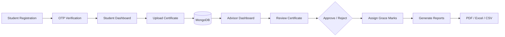

<div align="center">

# Certificate Management Portal

**A secure web-based platform for managing student certificates, grace marks, and advisor approvals with OTP authentication and automated report generation.**

[](https://python.org)
[](https://flask.palletsprojects.com/)
[](https://mongodb.com)
[](https://developer.mozilla.org)

</div>

---

# Overview

The **Certificate Management Portal** is a secure web application designed to simplify the submission, verification, and management of student certificates for extracurricular achievements.

Students can upload certificates for technical events, sports, cultural activities, research publications, and community service, while faculty advisors can review submissions, assign grace marks, approve or reject applications, and generate institutional reports.

The system includes **OTP-based authentication**, **role-based access control**, **certificate tracking**, **bulk approval workflows**, and **PDF/Excel/CSV report generation**.

---

# Features

| Module | Description |
|----------|-------------|
| **Student Portal** | Upload certificates, monitor approval status, and track accumulated grace marks. |
| **Advisor Portal** | Review submissions, allocate grace marks, approve/reject certificates, and manage students. |
| **OTP Authentication** | Secure login and registration using email verification. |
| **Grace Marks Management** | Automated allocation and tracking of grace marks based on institutional policies. |
| **Advanced Search & Filters** | Search certificates by student, branch, semester, event type, status, and more. |
| **Report Generation** | Export institutional reports in PDF, Excel, and CSV formats. |
| **Interactive Dashboard** | Charts and statistics for certificates, approvals, and student activity. |

---

# System Architecture



---

# Tech Stack

| Category | Technologies |
|----------|--------------|
| Backend | Python, Flask |
| Database | MongoDB |
| Authentication | Flask-JWT, Email OTP |
| Frontend | HTML5, CSS3, JavaScript |
| Charts | Chart.js |
| PDF Reports | jsPDF |
| Email | Flask-Mail |
| Environment | python-dotenv |

---

# Project Structure

```text
certificate-management-portal/
│
├── app.py
├── requirements.txt
├── .env
│
├── templates/
│   ├── login.html
│   ├── home.html
│   └── advisor.html
│
├── static/
│   ├── css/
│   ├── js/
│   └── certificates/
│
└── README.md
```

---

# Quick Start

## Prerequisites

- Python 3.10+
- MongoDB
- SMTP Email Account

---

## Installation

Clone the repository

```bash
git clone https://github.com/YOUR_USERNAME/certificate-management-portal.git

cd certificate-management-portal
```

Create a virtual environment

```bash
python -m venv .venv

source .venv/bin/activate
```

Install dependencies

```bash
pip install -r requirements.txt
```

---

## Environment Variables

Create a `.env` file.

```env
MONGO_URI=

JWT_SECRET_KEY=

MAIL_SERVER=smtp.gmail.com

MAIL_PORT=587

MAIL_USE_TLS=True

MAIL_USERNAME=

MAIL_PASSWORD=

MAIL_DEFAULT_SENDER=
```

---

## Run

```bash
python app.py
```

Open

```
http://127.0.0.1:5000
```

---

# Student Workflow

```text
Register
      │
      ▼
OTP Verification
      │
      ▼
Login
      │
      ▼
Upload Certificate
      │
      ▼
Pending Review
      │
      ▼
Advisor Approval
      │
      ▼
Grace Marks Added
```

---

# Advisor Workflow

```text
Login
     │
     ▼
Review Certificates
     │
     ├──── Approve
     │
     └──── Reject
     │
     ▼
Assign Grace Marks
     │
     ▼
Generate Reports
```

---

# Dashboard Features

### Student Dashboard

- Upload certificates
- Track approval status
- View accumulated grace marks
- Delete certificates securely

### Advisor Dashboard

- Review submissions
- Bulk approve/reject
- Student analytics
- Search & filtering
- Report generation
- Grace marks management

---

# API Endpoints

| Method | Endpoint | Purpose |
|---------|----------|----------|
| POST | `/api/auth/register` | Register user |
| POST | `/api/auth/login` | Login |
| POST | `/api/auth/verify` | Verify OTP |
| GET | `/api/students/profile` | Student profile |
| GET | `/api/students/my-certificates` | View certificates |
| POST | `/api/students/certificates` | Upload certificate |
| DELETE | `/api/students/certificates/{id}` | Delete certificate |
| GET | `/api/advisors/all-certificates` | View all submissions |
| POST | `/api/advisors/review-certificate/{id}` | Review certificate |
| POST | `/api/advisors/approve-all-by-id/{student_id}` | Bulk approve |
| POST | `/api/advisors/reject-all-by-id/{student_id}` | Bulk reject |

---

# Security Features

- Email OTP Authentication
- JWT-based Authorization
- Password Hashing
- Role-Based Access Control
- Secure Certificate Upload
- Protected API Routes

---

# Future Improvements

- Cloud Storage Integration
- Admin Dashboard
- Mobile Responsive UI
- Notification System
- Digital Certificate Verification
- QR Code Validation
- Docker Deployment

---

# License

This project is intended for educational and institutional use.

---

<div align="center">

**Built using Python, Flask, MongoDB, JavaScript, and JWT Authentication.**

</div>
